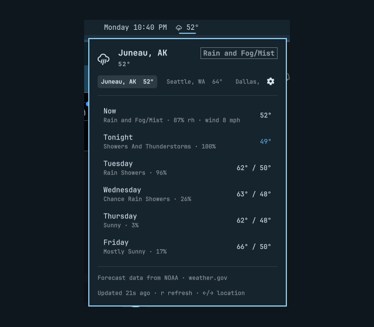

# NOAA Weather for the Omarchy bar

Current conditions and a multi-day forecast from **NOAA / weather.gov**, for one
or more locations, in the Omarchy bar.



```
bar:    ☀ 90°

popup:  ☀  Austin, TX                    [ Clear ]
           90°
        ┌ Austin, TX 90° ┐ Cabin 52°  Anchorage, AK 55°
        ─────────────────────────────────────────────
        Now                                      90°
        Clear · feels 92° · 44% rh · wind 11 mph
        Tonight                                  79°
        Mostly Clear
        Tuesday                            100° / 78°
        Mostly Sunny · 19%
        Wednesday                          100° / 79°
        Slight Chance Rain Showers · 19%
        Thursday                           101° / 78°
        ...
        Updated 27s ago · r refresh · ←/→ location
```

- **No API key, no account, no signup.** NOAA is a public service.
- **Any number of locations**: ZIP, city name, or `lat,lon`. Switch with ←/→.
- **No hardcoded location anywhere.** A fresh install asks you to add one.

## Why NOAA

I am from Alaska, where most weather apps and services get it wrong often enough
that you stop trusting them. The accurate reporting comes from the source. In
the United States that source is NOAA: the National Weather Service issues the
forecasts, and many of the apps you already use are built on that same data
after running it through their own models and presentation.

This plugin skips the middle. It reads `api.weather.gov` directly and shows what
the local forecast office actually wrote, in their wording, including the
qualifiers that get smoothed away elsewhere. That is the whole reason it exists,
and it is why it reports `outside NOAA coverage` for a place NOAA does not serve
rather than quietly falling back to a global aggregator. An answer from the
wrong model is worse than an honest gap.

> [!IMPORTANT]
> **United States only.** `api.weather.gov` is a US government service and has no
> data outside US territory. A non-US location resolves fine and then reports
> `outside NOAA coverage` rather than failing silently. If you need worldwide
> coverage, keep Omarchy's built-in `omarchy.weather` widget, which uses
> Open-Meteo. See [Replacing the built-in weather
> widget](#replacing-the-built-in-weather-widget).

## Install

```bash
omarchy plugin add https://github.com/Josh-Gotro/omarchy-noaa-weather.git --enable
```

**That is the whole install.** With nothing configured it detects your location
from your IP and shows the weather there, so it is useful before you touch a
setting.

## Uninstall

```bash
omarchy plugin remove gotro.noaa-weather
```

That unloads the widget, takes it off the bar, and moves the plugin folder aside
as a timestamped backup under `~/.config/omarchy/plugins/`. Your other plugins
and the rest of `shell.json` are untouched.

The only thing left behind is the cache, which is disposable and safe to keep or
delete:

```bash
rm -rf ~/.cache/omarchy-noaa-weather
```

If you disabled the built-in weather widget, put it back with:

```bash
omarchy plugin enable omarchy.weather --section center
```

## Replacing the built-in weather widget

Omarchy ships its own `omarchy.weather` widget, so after installing this one you
will have two temperatures in the bar. To retire the built-in:

```bash
omarchy plugin disable omarchy.weather
```

That takes it off the bar and leaves it installed. To bring it back:

```bash
omarchy plugin enable omarchy.weather --section center
```

Neither command touches this plugin, and you can run both widgets side by side
if you would rather compare them.

### Which one you want

They are not the same trade-off, and the built-in is the better choice for some
people:

| | `omarchy.weather` (built-in) | this plugin |
|---|---|---|
| Source | Open-Meteo | NOAA / weather.gov |
| Coverage | **Worldwide** | **United States only** |
| Locations | One, auto-detected | As many as you like, entered by hand |
| Forecast | Current conditions | Current + multi-day, per location |
| Configurable | No settings | Locations, units, days, interval |
| Forecast text | Derived from model codes | Written by NWS forecasters |

**If you are outside the US, keep the built-in.** This plugin has no data for
you, because `api.weather.gov` is a US government service. Its value is US-specific:
several locations at once, a real forecast, and NWS's own wording.

## Locations

One setting. Separate locations with **semicolons**, not commas, because
`Austin, TX` already contains one.

```
Austin, TX; 99801; 58.30,-134.42
```

| Form | Example | Resolved by |
|---|---|---|
| US ZIP | `78701` | zippopotam.us |
| City / place | `Austin, TX` | OpenStreetMap Nominatim |
| Coordinates | `30.27,-97.74` | nothing, used directly |

> [!NOTE]
> NOAA names a point by its **nearest place**, so two genuinely different
> coordinates can come back with the same name. `99801` and `Juneau downtown`
> are both "Juneau, AK". When labels collide, whatever you typed is appended to
> tell them apart: `Juneau, AK (99801)`. An alias avoids this entirely.

Append `|Name` to rename one in the popup:

```
78701|Home; Juneau, AK|Cabin; 58.30,-134.42|Lookout
```

The **first location is the one shown in the bar**. The rest live in the popup,
reachable with ←/→ or by clicking. Coordinates skip geocoding entirely, so they
are the fastest and most private option.

> [!NOTE]
> This is deliberately a **single-instance** widget (`allowMultiple: false`).
> One widget already holds every location, and settings are saved through
> `omarchy bar set <id> …`, which addresses a widget by id. With two instances
> of the same id, edits in one would land on the other.

## Adding and removing locations

Click the widget, then the **⚙ cog** in the popup header:

```
☁ Juneau, AK                     [ Light Rain ]
  52°
Locations                                     ✕
  ●  Juneau downtown  · in the bar     ⌃  🗑
  ○  Seattle                           ⌃  🗑
  ○  dallas                            ⌃  🗑
[ ZIP, city, or lat,lon, then Enter ]        +
Saved as you go. Click a location to put it in
the bar, or ⌃ to move it up one.
───────────────────────────────────────────────
Forecast data from NOAA · weather.gov
```

**Every action saves immediately**: there is no save button to forget. Add with
the field (Enter or **+**), remove with **🗑**.

**Click any location to put it in the bar.** The ● marks the one currently
there; the rest stay in the popup behind ←/→.

With enough locations the chip row is wider than the popup. It scrolls to
follow the selection, so arrowing to the last city brings its chip into view
rather than leaving it off the end.

**⌃ moves a location up one place**, for ordering the rest of the list. There is
no down arrow on purpose: down is just up on the row below, and two chevrons
side by side in a narrow row are fiddly to hit. The top row's arrow is dimmed,
having nothing above it.

Saving writes through `omarchy bar set`, so it lands in `shell.json` exactly as
a hand edit would, and the widget refetches on its own, with no restart and no manual
refresh.

The same thing from a terminal, if you prefer:

```bash
omarchy bar set gotro.noaa-weather locations "Austin, TX; 99801|Cabin"
```

or over IPC, which is bindable to a key:

```bash
omarchy-shell gotro.noaa-weather settings          # open the editor
omarchy-shell gotro.noaa-weather add "80202|Denver"
omarchy-shell gotro.noaa-weather remove 2          # by index
omarchy-shell gotro.noaa-weather move 2 -2        # index, offset
```

> [!NOTE]
> Omarchy has no generic settings-form UI for bar widgets. `manifest.json`
> declares a `schema` for every option, but nothing renders it. The cog above
> is this plugin's own. Options other than locations are set with
> `omarchy bar set <id> <key> <value>` or by editing `~/.config/omarchy/shell.json`.

## Automatic location

With `locations` empty, the plugin asks **ipapi.co** where your IP is (falling
back to **wttr.in**, which is what Omarchy's built-in weather widget uses) and
uses that. The popup says *Location detected automatically* so the guess is
never mistaken for a setting.

> [!IMPORTANT]
> This is IP geolocation: it locates the **network**, not the device, and on a
> VPN it reports the exit node. It runs **only while no location is configured**
> Set one and nothing is ever sent to those services again. The result is
> cached for 12 hours.
>
> To disable it outright, set `WEATHER_AUTOLOCATE=0`; the widget then asks for a
> location instead of guessing, and contacts no geolocation service at all.

Manual install, if you prefer:

```bash
git clone https://github.com/Josh-Gotro/omarchy-noaa-weather.git \
  ~/.config/omarchy/plugins/gotro.noaa-weather
omarchy plugin enable gotro.noaa-weather center
omarchy restart shell
```

**Requires** `curl` and `jq`, both of which Omarchy already ships.

## Settings

Applied with `omarchy bar set gotro.noaa-weather <key> <value>`, or by editing
the widget's entry in `~/.config/omarchy/shell.json`.

> [!TIP]
> `omarchy bar set` writes values as **strings** unless you pass `--json`, so
> `showText true` stores `"true"` rather than `true`. This plugin accepts either
> spelling for its boolean and numeric settings, but `--json` is the precise
> form if you want the real type in `shell.json`:
>
> ```bash
> omarchy bar set gotro.noaa-weather showText false --json
> omarchy bar set gotro.noaa-weather days 7 --json
> ```

| Setting | Default | Meaning |
|---|---|---|
| `locations` | *(empty)* | Semicolon-separated list; see above |
| `units` | `f` | `f` or `c` |
| `days` | `5` | Calendar days shown, **counting today**. In the evening today's entry is the overnight low, so `5` is today plus four full days. NOAA publishes about seven. |
| `showText` | `true` | Show the temperature beside the icon in the bar |
| `refreshIntervalSec` | `900` | 15 min. NOAA updates hourly; faster only risks rate limiting |
| `timeoutSec` | `12` | Per-request timeout |
| `userAgent` | *(empty)* | See below |
| `title` | `Weather` | Popup heading, used when a location has no label |
| `onClick` | *(empty)* | Middle-click command, e.g. `xdg-open https://forecast.weather.gov/` |
| `provider` | *(empty)* | Filename in `providers/`; empty uses the bundled NOAA one |

### User-Agent

NOAA asks API callers to identify themselves so they can contact you if your
traffic misbehaves. The plugin sends a generic identifier by default. Setting
`userAgent` to something with a contact address in it is good manners:

```
my-omarchy-bar (you@example.com)
```

## Interactions

| Where | Input | Action |
|---|---|---|
| Bar | left click | Toggle the popup |
| Bar | right click | Refresh now |
| Bar | middle click | Run `onClick` |
| Popup | ← / → | Previous / next location |
| Popup | ↑ / ↓ | Move the row cursor |
| Popup | cog | Add, remove, reorder; click one to put it in the bar |
| Popup | `r` | Refresh |
| Popup | `Esc` | Close |

Also over IPC, so locations can be bound to keys or scripted:

```bash
omarchy-shell gotro.noaa-weather status      # -> ok 90°
omarchy-shell gotro.noaa-weather locations   # -> Austin, TX 90° | Cabin 52° | Anchorage, AK 55°
omarchy-shell gotro.noaa-weather next        # -> Cabin 52°
omarchy-shell gotro.noaa-weather prev
omarchy-shell gotro.noaa-weather page 0      # -> Austin, TX 90°
omarchy-shell gotro.noaa-weather refresh
omarchy-shell gotro.noaa-weather settings    # open/close the location editor
omarchy-shell gotro.noaa-weather add "80202|Denver"
omarchy-shell gotro.noaa-weather remove 2    # by index
omarchy-shell gotro.noaa-weather move 2 -2  # reorder: index, offset
omarchy-shell gotro.noaa-weather command     # print the exact command it runs
```

## How it works

```
        timer
          │
   weather-fetch  ── one page per location, in order
          │
          ├── geocode          "Austin, TX" -> 30.2711 -97.7437 (cached forever)
          └── providers/noaa   lat,lon -> /points -> /forecast + nearest station
                     │
                weather.jq     NOAA JSON -> { label, text, icon, state, rows[] }
                     │
              BarWidget.qml    pill + popup + page switching
```

| File | Role |
|---|---|
| `manifest.json` | Declaration, defaults, option schema |
| `BarWidget.qml` | Bar item, popup, page switching, polling |
| `Model.js` | Command building, shell quoting, payload normalisation |
| `weather-fetch` | Orchestrates locations, assembles the pages |
| `geocode` | ZIP / city / `lat,lon` → coordinates, cached |
| `geolocate` | IP → coordinates, only when nothing is configured |
| `providers/noaa` | NOAA-specific fetching |
| `weather.jq` | NOAA JSON → one normalised page |

### Caching

`~/.cache/omarchy-noaa-weather/` holds:

Everything lives in one directory, created `0700` (the geocoding and
geolocation entries record where you have been looking).

| Cached | For |
|---|---|
| Geocoding results | indefinitely, since a ZIP does not move |
| NOAA `/points` grid lookup | 7 days, as NOAA asks callers to cache it |
| Forecast + latest observation | 5 minutes (`WEATHER_FORECAST_TTL`) |

The forecast cache is what keeps a burst of edits cheap: each editor action
triggers a refetch of **every** configured location, and without it, adding
three cities in a row is enough to trip NOAA's rate limiter. NOAA publishes
hourly, so five minutes costs nothing in freshness. Warm, a four-location fetch
takes ~1.2s and makes no network requests at all; cold it is ~8s.

Entries untouched for 30 days are pruned on the next run, so a machine that has
looked up many places does not accumulate files forever. Delete the directory to
force everything to re-resolve.

### Adding another provider

`providers/noaa` is the only file that knows NOAA exists. Any executable that
takes `<lat> <lon> [alias] [fallback-label]` and prints one page object works:

```json
{ "label": "Austin, TX", "condition": "Clear", "text": "90°", "icon": "☀",
  "state": "ok", "tooltip": "...", "rows": [ { "label": "Now", "value": "90°",
  "detail": "...", "state": "ok" } ] }
```

Drop it in `providers/`, then set `provider` (or `WEATHER_PROVIDER`) to its
filename. This is how you would add Open-Meteo for worldwide coverage, or a
keyed service like Windy.

> [!NOTE]
> A provider needing a **secret** should read it from a file, never from
> `shell.json`, which is world-readable config.

### Environment overrides

Useful for testing a provider or filter without touching the bar:

```bash
WEATHER_UNITS=c WEATHER_DAYS=7 ./weather-fetch "Austin, TX" | jq .
WEATHER_PROVIDER=noaa WEATHER_TIMEOUT=20 ./weather-fetch 78701
```

| Variable | Effect |
|---|---|
| `WEATHER_UNITS` | `f` or `c` |
| `WEATHER_DAYS` | Calendar days shown, counting today |
| `WEATHER_TIMEOUT` | Per-request seconds |
| `WEATHER_PROVIDER` | Which `providers/<name>` to use |
| `WEATHER_USER_AGENT` | Sent to NOAA and the geocoders |
| `WEATHER_CACHE_DIR` | Where the caches live |
| `WEATHER_FORECAST_TTL` | Forecast cache seconds (default 300) |
| `WEATHER_AUTOLOCATE=0` | **Never** IP-geolocate; show a setup prompt instead |
| `WEATHER_BUDGET` | Overall seconds per refresh before remaining locations are skipped (default 45) |

## Failure behaviour

Problems are shown, never swallowed. Each is a valid payload with an
explanation in the popup rather than a blank bar:

| Situation | Bar shows |
|---|---|
| No location configured yet | `set location` |
| A location cannot be geocoded | that location's page reads `!` |
| Location is outside the US | `outside NOAA coverage` on its page |
| NOAA rate limiting or 5xx | `NOAA is rate limiting…`, retried next poll |
| Some locations fail, others work | bar shows a working one, state drops to `warn` |
| All locations fail | `unavailable` |

A failed location keeps **its own slot** in the popup rather than being dropped,
so the order never shuffles between polls.

## Notes for anyone reading the code

- **NOAA's `/points` accepts at most 4 decimal places** and answers `301` to
  anything longer. Nominatim returns 7, so coordinates are rounded before the
  call. Without that, every city-name lookup bounces off a redirect.
- **`curl -f` collapses every HTTP ≥ 400 into exit 22**, which would make "not
  in the US" (404) indistinguishable from "rate limited" (429). The provider
  reads the status code explicitly instead.
- **The chip row scrolls to follow `pageIndex`.** Without it, arrowing past the
  visible chips showed the right forecast under a chip you could not see.
- **A poll that arrives while a fetch is running must be queued, not dropped.**
  A multi-location fetch takes seconds; the original `if (fetchProc.running)
  return` discarded any request made during one, so an edit mid-fetch was lost
  until the next 15-minute tick and the widget showed an older location list
  than `shell.json` held. It now coalesces and re-runs on completion.
- **The editor must not resync its list from `settings` while open.** `bar.run`
  is detached, so settings arrive after a write and may still describe the
  previous state; resyncing from that reset the list mid-edit, dropping entries
  and making a row's name flip between two locations while being moved. The
  editor owns the list while open and re-reads it on open.
- **Editor actions persist one at a time.** An earlier version staged changes
  behind a save button, which made "add" look like it did nothing.
- **A readonly QML property that nothing binds to is evaluated lazily**, so it
  emits no change signal until something reads it. Watching `settings` directly
  is what makes an edit refetch immediately; watching the derived
  `locationsSetting` silently did nothing.
- **`printf '%f'` honours `LC_NUMERIC`.** Coordinates are formatted under
  `LC_ALL=C`; without it, a comma-decimal locale (de_DE, fr_FR, pt_BR…) emits
  `30,2711` and builds a malformed NOAA URL: broken for those users, invisible
  to anyone testing in `en_US`.
- **Cache writes go through a temp file and a rename.** A plain redirect
  truncates the target first, so an interrupted run leaves a half-written file
  that poisons every read until its TTL expires. Reads also re-parse the file
  and discard it if it no longer parses.
- **Per-request timeouts do not bound a run.** Several locations times several
  requests times the timeout is minutes of a process the bar cannot cancel, so
  there is an overall budget after which the rest are skipped with a reason.
- **Settings can arrive as strings.** `omarchy bar set` stores `"true"`, not
  `true`, unless `--json` is passed, so a strict `=== true` check silently
  ignored the documented command (and asymmetrically: turning the option off
  appeared to work, turning it on did not). `Model.asBool` accepts both.
- **Never build a shell string from user input.** Settings are saved with
  `Util.execArgv([...])`, not `bar.run("…")`. `bar.run` is `execDetached`, which
  hands one string to `bash -lc`; `Util.qml` says outright to prefer `execArgv`
  for anything built from input, because argv entries land in positional
  parameters and are never re-tokenised. A city name is user input.
- **Never name a widget setting `exec`.** A bar entry with an `exec` key is
  claimed by Omarchy's own `CustomCommandModule` and the plugin never loads.
- **QML does not hot-reload.** Quickshell runs with `QS_DISABLE_FILE_WATCHER=1`.
  Run `omarchy restart shell` after editing `.qml` or `.js`. Changes to
  `weather-fetch`, `weather.jq`, `geocode` and settings apply on the next poll.

## Tests

```bash
./tests/run        # 30 assertions, no network
./tests/run -v     # show each one
```

The shaping tests run `weather.jq` against **frozen NOAA fixtures** in
`tests/fixtures/`, and the orchestrator tests use `lat,lon` locations (which
skip geocoding entirely) with a stub provider, so the suite is deterministic
and offline. It covers units, day counts, missing observations, condition
severity, page ordering, per-location failures, duplicate-label qualification,
and the setup states.

Regenerate the fixtures with a real request if NOAA's schema ever changes; they
are ordinary API responses.

## Attribution

Forecasts and observations from the **US National Weather Service**
(`api.weather.gov`), public domain. The popup credits NOAA on every view.

Geocoding by **zippopotam.us** and **OpenStreetMap Nominatim** (© OpenStreetMap
contributors, ODbL). Please respect Nominatim's usage policy; results here are
cached so a configured location is looked up once. Optional IP geolocation by
**ipapi.co** / **wttr.in**, used only when no location is configured.

## A note on shared code

`BarWidget.qml` and `Model.js` began as copies from a sibling plugin, and
Omarchy plugins are self-contained directories with no shared-library
mechanism. There is therefore no way to share this code between plugins short
of vendoring it, and fixes do not propagate on their own. The poll-coalescing
fix here, for instance, exists only in this plugin. Worth knowing before
copying this as a starting point for another widget.

## Colophon

This plugin was co-authored with [Claude Code](https://claude.com/claude-code).
The idea, the direction, and the review are mine; much of the implementation,
the test suite, and this documentation came out of that pairing.

## Licence

MIT
